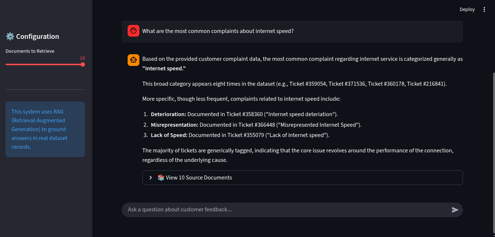
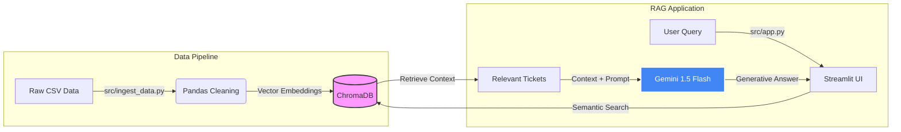

# 📡 Comcast Customer Feedback Analyzer (RAG)


An enterprise-grade **Retrieval-Augmented Generation (RAG)** application designed to analyze customer complaints. By leveraging **Google Gemini** and **ChromaDB**, this tool enables Customer Experience (CX) teams to perform semantic searches over raw feedback data and generate insights grounded in actual ticket records.



## 🏗️ Architecture



## 🚀 Key Features

* **🧠 Semantic Search:** Understands the *meaning* behind complaints (e.g., searching for "bad connection" finds tickets about "latency", "packet loss", and "slow speeds").
* **🏭 robust ETL Pipeline:** Automatic ingestion system that detects, cleans, and embeds CSV data directly from the source.
* **🐳 Dockerized:** Fully containerized environment ensuring consistency across development and production.
* **🛡️ Quality Assurance:** Includes automated unit tests (`pytest`) and code formatting (`ruff`).
* **🔍 Transparency:** The UI cites specific Ticket IDs for every claim made by the AI.

## 🛠️ Tech Stack

* **LLM:** Google Gemini Flash Latest (via `langchain-google-genai`)
* **Vector Store:** ChromaDB (Local persistent storage)
* **Orchestration:** LangChain Core
* **Web Framework:** Streamlit
* **Dependency Management:** Poetry
* **DevOps:** Docker & Makefile

## 📂 Project Structure

```text
rag-feedback-analyzer/
├── .github/workflows/   # CI/CD Pipeline
├── data/raw/            # Raw CSV storage (gitignored)
├── chroma_db_data/      # Vector Database storage (gitignored)
├── src/
│   ├── app.py           # Streamlit Frontend
│   └── ingest_data.py   # ETL Pipeline Script
├── tests/               # Pytest Unit Tests
├── Dockerfile           # Production Image definition
├── Makefile             # Command shortcuts
├── pyproject.toml       # Dependencies
└── README.md            # Project Documentation

```
## 📊 Dataset & Privacy

This project uses the **Comcast Telecom Consumer Complaints** dataset.

* **Automatic Setup:** The `make ingest` command attempts to download the data automatically from a public mirror.
* **Manual Setup (Fallback):** If the automatic download fails, you can manually download the dataset:
    1.  Download the CSV from [Kaggle](https://www.kaggle.com/datasets/archaeocharlie/comcastcustomerservice) or [GitHub Mirror](https://github.com/Rahulkumarr2080/Comcast-Telecom-Consumer-Complaints/blob/master/Comcast_telecom_complaints_data.csv).
    2.  Place the file inside the `data/raw/` folder.
    3.  Run `make ingest` normally.

*Note: No proprietary data is included in this repository to comply with privacy standards.*

## 🏃‍♂️ Getting Started

### Prerequisites

* Docker (Optional, but recommended)
* Python 3.11+ (If running locally)
* A Google Cloud API Key (Gemini)

### 1. Environment Setup

Create a `.env` file in the root directory:

```bash
GOOGLE_API_KEY="your_google_api_key_here"

```

### 2. Running with Docker (Recommended)

The easiest way to run the application is using the provided Makefile.

```bash
# Build the image
make docker-build

# Run the container (Access at http://localhost:8501)
make docker-run

# Stop the container
make docker-stop

```

### 3. Running Locally (Development)

If you prefer to run it without Docker:

```bash
# Install dependencies
make install

# Run the ETL Pipeline (Downloads and indexes data)
make ingest

# Start the App
make run

```

## 🧪 Testing & Code Quality

This project maintains high code quality standards.

```bash
# Run Unit Tests
make test

# Format Code (Ruff)
make format

# Lint Code
make lint

```

## 📝 License

This project is licensed under the MIT License - see the LICENSE file for details.

---
